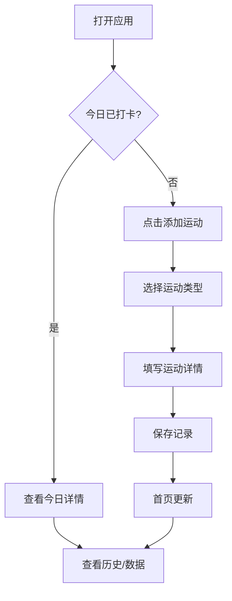

# 健身记录小程序 - 产品需求文档

## 1. 产品概述

一款简洁高效的每日健身记录小程序，帮助用户追踪运动习惯、记录训练数据、养成健康生活方式。

### 核心目标
- 解决用户难以坚持健身习惯的问题
- 提供直观的数据可视化，帮助用户了解运动趋势
- 简化健身记录流程，降低使用门槛

### 目标用户
- 健身初学者和日常健身爱好者
- 希望建立规律运动习惯的人群
- 需要追踪训练进展的健身者

## 2. 核心功能

### 2.1 用户角色

| 角色 | 注册方式 | 核心权限 |
|------|----------|----------|
| 普通用户 | 无需注册 | 浏览、记录、查看历史数据 |

### 2.2 功能模块

1. **首页（今日打卡）**：快速记录今日运动、查看打卡状态
2. **运动记录**：添加不同类型的运动项目及详情
3. **历史记录**：查看过往运动数据和日历视图
4. **我的数据**：个人运动统计和趋势分析

### 2.3 页面详情

#### 首页（今日打卡）
| 模块名称 | 功能描述 |
|----------|----------|
| 今日状态卡片 | 显示今日是否已打卡、运动时长、消耗卡路里 |
| 快速添加运动 | 一键添加常用运动项目 |
| 今日运动列表 | 展示今日添加的所有运动记录 |
| 打卡日历 | 月度视图显示打卡连续性 |

#### 运动记录页面
| 模块名称 | 功能描述 |
|----------|----------|
| 运动类型选择 | 跑步、力量训练、瑜伽、游泳、骑行、拉伸等 |
| 运动详情表单 | 时长、距离、重量、组数、次数等参数 |
| 备注信息 | 添加运动感受或特殊说明 |
| 保存确认 | 保存记录到本地存储 |

#### 历史记录页面
| 模块名称 | 功能描述 |
|----------|----------|
| 日历视图 | 按日期查看运动记录 |
| 列表视图 | 按时间倒序展示所有记录 |
| 筛选功能 | 按运动类型筛选记录 |

#### 我的数据页面
| 模块名称 | 功能描述 |
|----------|----------|
| 运动统计 | 本周/本月运动次数、时长、卡路里 |
| 连续打卡天数 | 当前连续打卡记录 |
| 运动类型分布 | 饼图展示各类运动占比 |
| 周趋势图 | 近7天运动时长折线图 |

## 3. 核心流程

### 3.1 每日健身记录流程

用户打开应用 → 首页查看今日状态 → 点击添加运动 → 选择运动类型 → 填写运动详情 → 保存记录 → 首页更新显示

### 3.2 流程图

## 4. 用户界面设计

### 4.1 设计风格

**风格定位**：运动活力风格 (Active Energy)

**色彩方案**：
- 主色调：活力橙 `#FF6B35` - 代表运动激情与活力
- 辅助色：深灰 `#2D3436` - 内容与文字
- 强调色：薄荷绿 `#00D9A5` - 打卡成功、正向反馈
- 背景色：浅灰白 `#F8F9FA` - 干净舒适的视觉体验
- 渐变：从橙色到红色的动态渐变用于关键按钮

**字体选择**：
- 标题字体：`Poppins` - 现代运动感
- 正文字体：`Noto Sans SC` - 清晰易读的中文显示

**按钮样式**：
- 圆角卡片式按钮，16px圆角
- 主要按钮使用渐变橙色背景
- 次要按钮使用描边样式

**图标风格**：
- 使用 Lucide Icons 线性图标
- 运动类型使用自定义 emoji 图标增强识别度

### 4.2 页面设计概览

#### 首页
| 模块 | 布局 | 颜色 | 字体 | 动画 |
|------|------|------|------|------|
| 今日状态卡片 | 顶部大卡片 | 橙色渐变背景 | Poppins Bold | 数字递增动画 |
| 快速添加按钮 | 横向滚动卡片 | 白色背景+图标色 | Noto Sans SC | 点击缩放反馈 |
| 运动列表 | 垂直列表 | 白色卡片 | Noto Sans SC | 列表项滑入动画 |

#### 历史记录
| 模块 | 布局 | 颜色 | 字体 | 动画 |
|------|------|------|------|------|
| 日历组件 | 7列网格 | 打卡日期橙色 | Poppins | 日期切换滑动 |
| 记录列表 | 时间线布局 | 左侧时间轴橙色 | Noto Sans SC | 淡入效果 |

#### 数据统计
| 模块 | 布局 | 颜色 | 字体 | 动画 |
|------|------|------|------|------|
| 统计卡片 | 2列网格 | 白色+图标背景色 | Poppins | 数字飞入动画 |
| 趋势图表 | 全宽图表 | 橙色线条+渐变填充 | - | 线条绘制动画 |

### 4.3 响应式设计

- 移动端优先设计 (Mobile-first)
- 最大宽度限制 480px，居中显示
- 触摸优化：最小点击区域 44x44px
- 底部导航栏固定，支持快速切换

### 4.4 交互反馈

- 打卡成功：脉冲动画 + 成功提示
- 添加记录：底部滑出抽屉表单
- 删除记录：滑动删除 + 确认提示
- 加载状态：骨架屏占位
