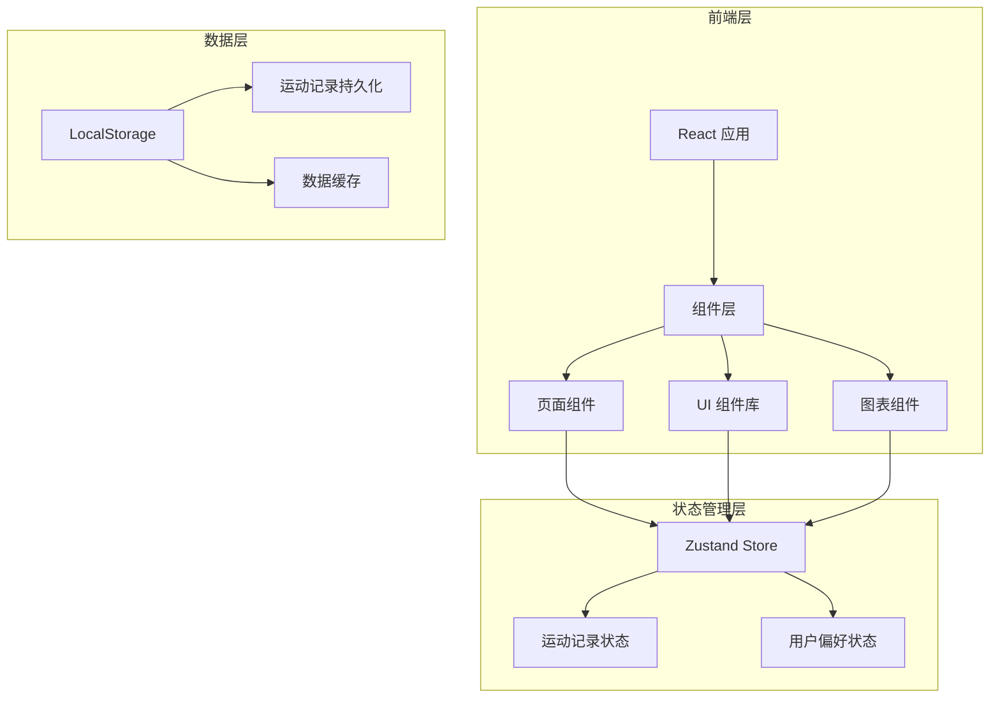

# 健身记录小程序 - 技术架构文档

## 1. 架构设计

### 1.1 系统架构图



### 1.2 技术栈

- **前端框架**：React 18 + TypeScript
- **构建工具**：Vite
- **样式方案**：Tailwind CSS
- **状态管理**：Zustand
- **图表库**：Recharts
- **图标库**：Lucide React
- **数据存储**：LocalStorage
- **路由管理**：React Router DOM

## 2. 路由定义

| 路由路径 | 页面名称 | 功能描述 |
|----------|----------|----------|
| `/` | 首页/今日打卡 | 快速记录、查看今日状态 |
| `/records` | 历史记录 | 日历视图、记录列表 |
| `/stats` | 数据统计 | 运动分析、趋势图表 |
| `/add` | 添加记录 | 运动表单（Modal形式） |

## 3. 数据模型

### 3.1 运动记录数据结构

```typescript
interface ExerciseRecord {
  id: string;                    // 唯一标识符
  date: string;                   // 运动日期 (YYYY-MM-DD)
  type: ExerciseType;             // 运动类型
  duration: number;               // 运动时长 (分钟)
  calories: number;               // 消耗卡路里
  distance?: number;              // 距离 (公里，可选)
  weight?: number;               // 重量 (公斤，可选)
  sets?: number;                  // 组数 (可选)
  reps?: number;                  // 次数 (可选)
  notes?: string;                 // 备注信息
  createdAt: string;              // 创建时间戳
}

type ExerciseType = 
  | 'running'     // 跑步
  | 'strength'    // 力量训练
  | 'yoga'        // 瑜伽
  | 'swimming'    // 游泳
  | 'cycling'     // 骑行
  | 'stretching'  // 拉伸
  | 'walking'     // 快走
  | 'other';      // 其他
```

### 3.2 数据统计模型

```typescript
interface DailyStats {
  date: string;                   // 日期 (YYYY-MM-DD)
  totalDuration: number;          // 总时长
  totalCalories: number;          // 总卡路里
  recordCount: number;            // 记录数量
  exerciseTypes: ExerciseType[];  // 运动类型列表
}

interface WeeklyStats {
  weekStart: string;              // 周起始日期
  dailyStats: DailyStats[];       // 每日统计
  totalDuration: number;           // 周总时长
  totalCalories: number;           // 周总卡路里
  streakDays: number;              // 连续打卡天数
}
```

## 4. 组件结构

### 4.1 页面组件

```
src/pages/
├── HomePage.tsx          # 首页/今日打卡
├── RecordsPage.tsx       # 历史记录页
├── StatsPage.tsx         # 数据统计页
└── components/
    ├── AddExerciseModal.tsx    # 添加运动模态框
    ├── ExerciseCard.tsx        # 运动记录卡片
    ├── Calendar.tsx            # 日历组件
    └── ExerciseChart.tsx       # 统计图表
```

### 4.2 通用组件

```
src/components/
├── BottomNav.tsx         # 底部导航栏
├── Header.tsx            # 页面头部
├── Button.tsx            # 按钮组件
├── Card.tsx              # 卡片组件
├── Input.tsx             # 输入框组件
└── Icon.tsx              # 图标组件封装
```

### 4.3 状态管理 (Zustand Store)

```typescript
interface ExerciseStore {
  // 状态
  records: ExerciseRecord[];
  todayRecords: ExerciseRecord[];
  streak: number;
  
  // 方法
  addRecord: (record: Omit<ExerciseRecord, 'id' | 'createdAt'>) => void;
  deleteRecord: (id: string) => void;
  getRecordsByDate: (date: string) => ExerciseRecord[];
  getWeeklyStats: () => WeeklyStats;
  calculateStreak: () => number;
}
```

## 5. 核心功能实现

### 5.1 运动类型卡路里计算

```typescript
const CALORIES_PER_MINUTE: Record<ExerciseType, number> = {
  running: 10,      // 跑步: 约10卡/分钟
  swimming: 8,      // 游泳: 约8卡/分钟
  cycling: 7,       // 骑行: 约7卡/分钟
  strength: 6,      // 力量训练: 约6卡/分钟
  yoga: 4,          // 瑜伽: 约4卡/分钟
  stretching: 3,   // 拉伸: 约3卡/分钟
  walking: 5,      // 快走: 约5卡/分钟
  other: 5,         // 其他: 默认5卡/分钟
};
```

### 5.2 连续打卡计算

```typescript
function calculateStreak(records: ExerciseRecord[]): number {
  const dates = new Set(records.map(r => r.date));
  let streak = 0;
  const today = new Date();
  
  for (let i = 0; i < 365; i++) {
    const date = formatDate(subDays(today, i));
    if (dates.has(date)) {
      streak++;
    } else if (i > 0) {  // 今天不算中断
      break;
    }
  }
  
  return streak;
}
```

## 6. 页面设计规格

### 6.1 首页布局

```
┌─────────────────────────────┐
│         顶部导航            │
├─────────────────────────────┤
│  ┌───────────────────────┐  │
│  │    今日打卡状态卡片    │  │
│  │    (大尺寸渐变卡片)    │  │
│  │    打卡状态 | 时长     │  │
│  └───────────────────────┘  │
│                             │
│  快速添加 ────────────────  │
│  ┌───┐ ┌───┐ ┌───┐ ┌───┐  │
│  │跑步│ │力量│ │瑜伽│ │更多│  │
│  └───┘ └───┘ └───┘ └───┘  │
│                             │
│  今日运动记录               │
│  ┌───────────────────────┐  │
│  │ 运动卡片 1            │  │
│  └───────────────────────┘  │
│  ┌───────────────────────┐  │
│  │ 运动卡片 2            │  │
│  └───────────────────────┘  │
├─────────────────────────────┤
│    🏠    📋    📊           │
│    首页  记录  数据          │
└─────────────────────────────┘
```

### 6.2 响应式断点

| 断点 | 宽度范围 | 布局调整 |
|------|----------|----------|
| Mobile | < 480px | 单列布局，底部导航 |
| Tablet | 480-768px | 保持单列，最大宽度480px居中 |
| Desktop | > 768px | 最大宽度480px居中，阴影边框 |

## 7. 性能优化

- 使用 React.memo 优化组件渲染
- 运动记录数据使用虚拟化列表（如果记录过多）
- 图片资源懒加载
- 使用 useMemo 和 useCallback 缓存计算结果
- LocalStorage 操作批量处理

## 8. 数据持久化策略

- 所有运动记录存储在 LocalStorage
- 键名约定：`fitness_records`
- 每次操作后同步更新存储
- 数据迁移版本控制（预留扩展）
